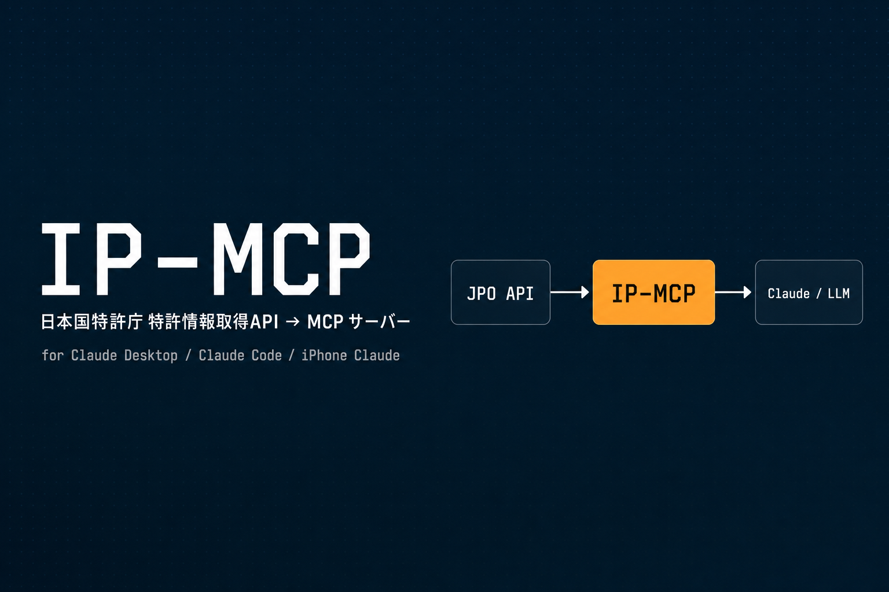
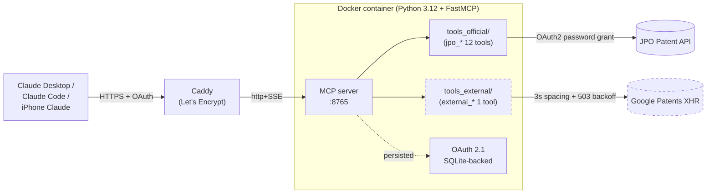

<p align="center">
  
</p>

# IP-MCP

[](LICENSE)
[](https://www.python.org/downloads/)
[](https://modelcontextprotocol.io/)

> **MCP server wrapping the Japan Patent Office's official "Patent Information Retrieval API" so Claude Desktop / Claude Code / iPhone Claude can query Japanese patents in natural language.**
>
> 12 official-API tools (number conversion, examination progress, registration, citations, applicant lookup, OPD family, etc.) + 1 keyword-search tool (Google Patents, deliberately isolated).

🇯🇵 日本語: [README.md](README.md)

---

## What you can ask Claude in 30 seconds

> **You**: "Tell me the registration status and prior art of JP-2010-228687."
>
> **Claude (under the hood)**:
> 1. `jpo_convert_patent_number` → application number `2009080841`
> 2. `jpo_get_patent_registration` → registration 5094774, Hitachi Ltd., expires 2029-03-30, alive
> 3. `jpo_get_patent_citations` → 20 prior-art references
>
> **Reply**: "Train Control Ground Equipment and System" (Hitachi Ltd.) was registered as JP5094774 on 2012-09-28, currently in force, due 2029-03-30. 20 prior-art citations from search report and rejection-grounds, all patent literature (no NPL)...

Keyword search is split into a **separate tool** (`external_search_patents_by_keyword`, Google Patents XHR). The LLM can never accidentally fall back from the official API to the unofficial source — every response carries an explicit `source` field.

---

## Why a separate tool category for keyword search?

The official JPO API is **number-lookup only** — every one of its 42 endpoints takes an application/publication/registration number, an applicant code, or an **exact-match** applicant name. Keyword / IPC / F-term / date-range / partial-name search does not exist in the spec. So:

- `tools_official/` — names start with `jpo_*`, response is `{"source": "jpo_official", ...}`
- `tools_external/` — names start with `external_*`, response is `{"source": "google_patents_unofficial", ...}`
- A boundary test forbids any `import` from `tools_external/` into `tools_official/`. **No silent fallback** — the LLM decides whether to consult the unofficial source.

---

## Architecture



---

## Quick start

```bash
cp .env.example .env          # Fill in JPO_USERNAME / JPO_PASSWORD
chmod 600 .env
docker compose up -d --build
```

For LAN-wide deployment, create `docker-compose.override.yml` to bind to your LAN interface, then point Claude Desktop / Code at `http://<HOST>:8765/sse`.

For public exposure (iPhone Claude / claude.ai), set up a reverse proxy with Let's Encrypt and supply both `MCP_OAUTH_MASTER_PASSWORD` and `MCP_OAUTH_ISSUER_URL`. The server requires OAuth 2.1 (DCR + PKCE + master-password consent). Issued tokens persist to SQLite and survive container restarts.

See [PLAN.md §9-§10](PLAN.md) and [OPERATIONS.md](OPERATIONS.md) for full deployment + operations details (Japanese only for now).

---

## Tool list

<details>
<summary><b>Official JPO API tools (12)</b></summary>

| Name | Purpose |
|---|---|
| `jpo_convert_patent_number` | Convert between application / publication / registration numbers |
| `jpo_get_patent_progress` | Examination progress (full / simple) |
| `jpo_get_patent_registration` | Registration info & right status |
| `jpo_get_patent_citations` | Cited prior-art documents |
| `jpo_get_divisional_apps` | Divisional applications |
| `jpo_get_priority_apps` | Priority-basis applications |
| `jpo_lookup_applicant` | Applicant code ⇄ name (**exact match only**) |
| `jpo_get_patent_documents` | Office actions / refusal reasons / amendments (handles inline ZIP + signed URL) |
| `jpo_get_jpp_url` | J-PlatPat canonical URL |
| `jpo_get_opd_family` | Patent family across JPO / USPTO / EPO / CNIPA / KIPO |
| `jpo_get_opd_doc_list` | OPD document list |
| `jpo_fetch_full_record` | Composite tool fanning out to multiple official endpoints |

</details>

<details>
<summary><b>External keyword search (1, isolated)</b></summary>

| Name | Purpose |
|---|---|
| `external_search_patents_by_keyword` | Free-text / assignee / IPC / date-range search of Japanese patents (via Google Patents XHR) |

Returns `{"source": "google_patents_unofficial"}`. **Never falls back to JPO on failure** — the official API has no keyword-search capability, so the call cannot meaningfully retry against it.

</details>

---

## Docs

- 📐 [PLAN.md](PLAN.md) — Design plan (architecture, full tool list, phased plan) [JP]
- 🤖 [CLAUDE.md](CLAUDE.md) — Claude Code guide (architectural rules, JPO API gotchas) [JP]
- 🔧 [OPERATIONS.md](OPERATIONS.md) — Operations runbook (access-log summary, master-password rotation, troubleshooting) [JP]

## License

MIT
