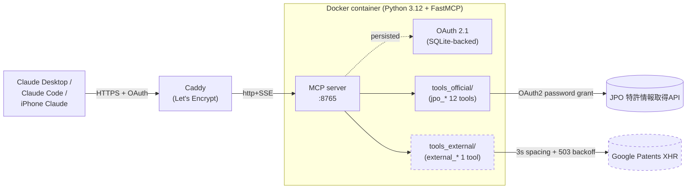

<p align="center">
  
</p>

# IP-MCP

[](LICENSE)
[](https://www.python.org/downloads/)
[](https://modelcontextprotocol.io/)
[](https://github.com/kitepon-rgb/IP-MCP/actions/workflows/ci.yml)

> **特許庁の公式「特許情報取得API」を MCP サーバー化して、Claude Desktop / Claude Code / iPhone Claude から自然言語で日本特許を引く。**
>
> 番号変換・経過情報・登録情報・引用文献・出願人検索・五庁ファミリー (OPD)、合計 12 ツール（公式）+ 1 ツール（Google Patents キーワード検索、独立分離）。

🇬🇧 English: [README.en.md](README.en.md)

---

## 30 秒で何ができるか

Claude にこう聞ける（裏で MCP ツールが連鎖実行）:

> **ユーザー**: 「特開2010-228687 の登録状況と引用文献を教えて」
>
> **Claude (内部動作)**:
> 1. `jpo_convert_patent_number` で公開番号→出願番号 (`2009080841`)
> 2. `jpo_get_patent_registration` で登録情報 (登録 5094774、株式会社日立製作所、満了 2029-03-30、権利存続中)
> 3. `jpo_get_patent_citations` で引用文献 20 件
>
> **回答**: 「列車制御地上装置およびシステム」(株式会社日立) は登録番号 5094774 として 2012-09-28 に登録、現在も権利存続中、満了予定 2029-03-30。引用文献は 20 件、検索報告書 / 拒絶理由から特許文献のみ（非特許文献なし）...

キーワード検索は外部ツール (`external_search_patents_by_keyword`) で **明示的に分離**。LLM が「公式データ」と「参考データ」を取り違えないよう、レスポンスの `source` フィールドで識別を強制。

---

## 既存手段との比較

| 比較項目 | J-PlatPat (Web UI 手動) | 既存 Flask 自作 | **IP-MCP** | Google Patents 直叩き |
|---|---|---|---|---|
| データソース | 公式 (JPO) | 公式 (JPO) | 公式 (JPO) + 外部 (オプション) | 非公式 |
| 番号変換・経過・登録・引用 | ✓ (人手) | ✓ | ✓ | ❌ |
| キーワード検索 | ✓ | ✓ | △ (外部ツールに分離) | ✓ |
| LLM から直接呼び出し | ❌ | ❌ (REST 経由 + パース要) | ✅ ネイティブ MCP | △ (HTML/JSON パース要) |
| 公式 / 非公式の区別 | — | 単一ソース | ✅ レスポンスに `source` 必須 | — |
| 自動フォールバック | — | — | ❌ 禁止 (LLM に判断させる) | — |
| 認証 | セッション | env | env or OAuth 2.1 (DCR + PKCE) | 不要 |
| デプロイ | — | 自前 | Docker Compose | — |

---

## アーキテクチャ



**架構の核**:
- `tools_official/` (公式 JPO) と `tools_external/` (非公式 Google Patents) は **コード階層・呼び出し元・ロガー完全分離**。`tools_official/` から `tools_external/` への `import` を boundary test で禁止
- 同一データソース内の再試行のみ許可 (401→トークン更新 / 303→指数バックオフ)。失敗時の自動フォールバック禁止 — LLM に判断させる
- レスポンスは必ず `{"source": "jpo_official"}` または `{"source": "google_patents_unofficial"}`

---

## クイックスタート

### ローカル開発

```bash
cp .env.example .env          # JPO_USERNAME / JPO_PASSWORD を記入
chmod 600 .env
docker compose up -d --build
```

### LAN デプロイ (no-auth)

`docker-compose.override.yml` を作成して LAN IP にバインド (リポジトリには `docker-compose.override.yml.example` あり):

```yaml
services:
  ip-mcp:
    ports:
      - "192.0.2.10:8765:8765"   # 自分の LAN IP
```

Claude Desktop / Code 設定:

```json
{
  "mcpServers": {
    "ip-mcp": {
      "transport": { "type": "sse", "url": "http://192.0.2.10:8765/sse" }
    }
  }
}
```

### iPhone Claude / claude.ai (公開、OAuth 2.1)

リバースプロキシで HTTPS + サブドメイン公開し、`MCP_OAUTH_MASTER_PASSWORD` + `MCP_OAUTH_ISSUER_URL` をセット。OAuth 2.1 (DCR + PKCE + マスターパスワード認可) を要求します。クライアントトークンは SQLite に永続化されコンテナ再起動でも生き残り。

```env
MCP_OAUTH_MASTER_PASSWORD=<24+ chars random>
MCP_OAUTH_ISSUER_URL=https://<your-subdomain>.example.com
# 任意: MCP_OAUTH_DB_PATH=/app/data/oauth.db
```

詳細は [PLAN.md §9-§10](PLAN.md) と [OPERATIONS.md](OPERATIONS.md)。

---

## 公開ツール一覧

<details>
<summary><b>公式 JPO API ベース (12 ツール)</b> — クリックで展開</summary>

| ツール名 | 役割 |
|---|---|
| `jpo_convert_patent_number` | 出願⇄公開⇄登録 番号変換 |
| `jpo_get_patent_progress` | 経過情報 (フル / シンプル切替) |
| `jpo_get_patent_registration` | 登録情報・権利状態 |
| `jpo_get_patent_citations` | 引用文献一覧 |
| `jpo_get_divisional_apps` | 分割出願情報 |
| `jpo_get_priority_apps` | 優先基礎出願情報 |
| `jpo_lookup_applicant` | 出願人名⇄コード（**完全一致のみ**）|
| `jpo_get_patent_documents` | 申請書類 / 拒絶理由 / 発送書類（binary ZIP / signed URL 両対応）|
| `jpo_get_jpp_url` | J-PlatPat 固定 URL 生成 |
| `jpo_get_opd_family` | 五庁ファミリー (USPTO/EPO/CNIPA/KIPO) |
| `jpo_get_opd_doc_list` | OPD 書類リスト |
| `jpo_fetch_full_record` | 同一番号で複数ツールを束ねた高位コンポジット (公式 API 内のみで完結) |

レスポンス: `{"ok": true, "source": "jpo_official", "data": {...}, "remaining_today": "..."}`

</details>

<details>
<summary><b>外部キーワード検索 (1 ツール、独立分離)</b> — クリックで展開</summary>

| ツール名 | 役割 |
|---|---|
| `external_search_patents_by_keyword` | 自然語キーワード / 出願人 / IPC / 日付レンジで日本特許検索 (Google Patents XHR、参考用) |

レスポンス: `{"ok": true, "source": "google_patents_unofficial", "data": {...}}`

公式 API はキーワード検索を提供しない（番号ルックアップ型のみ）ため独立。失敗時は `{"ok": false, "kind": "search_unavailable"}` を返し、**公式ツールに自動フォールバックしない**。

</details>

---

## レート制約（運用上の注意）

JPO 公式 API は自主制御責任を運用者に課している:

- 分次レート: `/api/patent/*` は **10 req/min**、`/opdapi/*` は **5 req/min**（OPD は別系統で別カウント）
- 日次クォータ: エンドポイントごとに 30〜800/日（2026 年 3 月から国内系は 2 倍緩和済）。実残量は各レスポンスの `result.remainAccessCount` が信頼ソース
- `jpo_fetch_full_record` は内部で **4 つの公式エンドポイントを並列**で叩くため、1 コール = 4 つの別々の日次クォータから 1 ずつ消費する（同一クォータから 4 ではない）

ツールごとのエンドポイント対応表と、運用上の閾値の感覚は [OPERATIONS.md §JPO API レート制約とクォータ](OPERATIONS.md#jpo-api-レート制約とクォータ) を参照。

---

## ドキュメント

- 📐 [PLAN.md](PLAN.md) — 設計計画書（アーキテクチャ・全ツール一覧・段階計画）
- 🤖 [CLAUDE.md](CLAUDE.md) — Claude Code 向け操作ガイド（譲れない設計規則・JPO API の罠）
- 🔧 [OPERATIONS.md](OPERATIONS.md) — 運用手順（アクセスログ集計・マスターパスワード rotate・トラブルシュート）

---

<details>
<summary>プレースホルダの読み替え（Public リポジトリのため LAN IP / SSH ユーザー名はマスク）</summary>

| プレースホルダ | 例 | 設定方法 |
|---|---|---|
| `<DEPLOY_HOST>` | `192.0.2.10` | デプロイ先サーバーの LAN IP |
| `<SSH_USER>` | `alice` | サーバーの SSH ユーザー名 |

`docker-compose.yml` のポートバインドはデフォルト `127.0.0.1:8765` (= 同マシンからのみ)。LAN 公開する場合は `docker-compose.override.yml` を別途作成 (`.gitignore` 済) して上書きしてください。

</details>

## ライセンス

MIT
