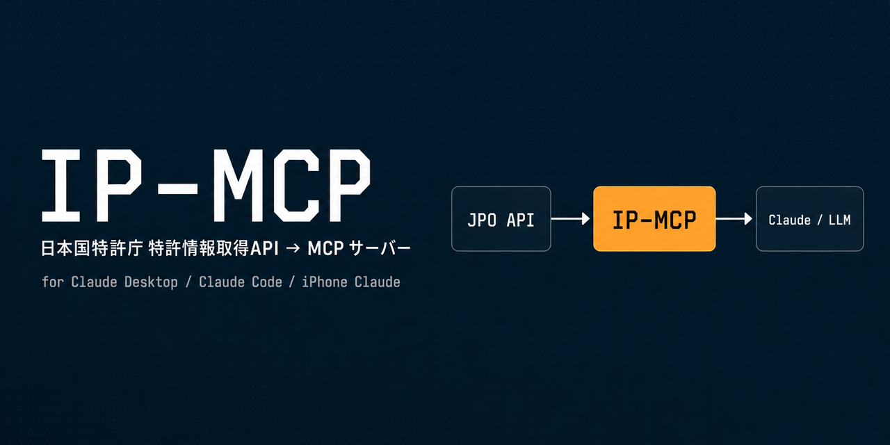
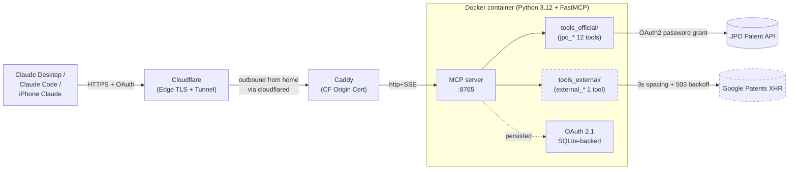

<p align="center">
  
</p>

# IP-MCP

[](LICENSE)
[](https://www.python.org/downloads/)
[](https://modelcontextprotocol.io/)
[](https://github.com/kitepon/IP-MCP/actions/workflows/ci.yml)
[](https://github.com/kitepon/IP-MCP/releases)

**English** · [日本語](README.ja.md)

> **Query Japanese patents in natural language from Claude.**
> IP-MCP wraps the Japan Patent Office's official "Patent Information Retrieval API" as an MCP server, so Claude Desktop, Claude Code, and iPhone Claude can resolve patent numbers, check registration status, pull citations, and walk five-office families — 12 official-API tools plus 1 deliberately isolated keyword-search tool.

---

## What you can ask Claude in 30 seconds

> **You**: "Tell me the registration status and prior art of JP-2010-228687."
>
> **Claude (under the hood)**:
> 1. `jpo_convert_patent_number` → application number `2009080841`
> 2. `jpo_get_patent_registration` → registration 5094774, Hitachi Ltd., expires 2029-03-30, alive
> 3. `jpo_get_patent_citations` → 20 prior-art references
>
> **Reply**: "Train Control Ground Equipment and System" (Hitachi Ltd.) was registered as JP5094774 on 2012-09-28, currently in force, due 2029-03-30. 20 prior-art citations from search report and rejection grounds, all patent literature (no NPL)…

Keyword search is split into a **separate tool** (`external_search_patents_by_keyword`, Google Patents XHR). The LLM can never accidentally fall back from the official API to the unofficial source — every response carries an explicit `source` field.

---

## How it compares

| | J-PlatPat (manual web UI) | Hand-rolled Flask wrapper | **IP-MCP** | Hitting Google Patents directly |
|---|---|---|---|---|
| Data source | Official (JPO) | Official (JPO) | Official (JPO) + external (optional) | Unofficial |
| Number convert / progress / registration / citations | ✓ (by hand) | ✓ | ✓ | ❌ |
| Keyword search | ✓ | ✓ | △ (isolated external tool) | ✓ |
| Callable directly from an LLM | ❌ | ❌ (REST + parsing needed) | ✅ native MCP | △ (HTML/JSON parsing needed) |
| Official vs. unofficial distinction | — | single source | ✅ mandatory `source` field | — |
| Automatic fallback | — | — | ❌ forbidden (the LLM decides) | — |
| Auth | session | env | env or OAuth 2.1 (DCR + PKCE) | none |
| Deploy | — | DIY | Docker Compose | — |

### Why a separate tool category for keyword search?

The official JPO API is **number-lookup only** — every endpoint takes an application / publication / registration number, an applicant code, or an **exact-match** applicant name. Keyword / IPC / F-term / date-range / partial-name search does not exist in the spec. So:

- `tools_official/` — names start with `jpo_*`, response is `{"source": "jpo_official", …}`
- `tools_external/` — names start with `external_*`, response is `{"source": "google_patents_unofficial", …}`
- A boundary test forbids any `import` from `tools_external/` into `tools_official/`. **No silent fallback** — the LLM decides whether to consult the unofficial source.

---

## Architecture


```mermaid
flowchart LR
    User["Claude Desktop /<br/>Claude Code /<br/>iPhone Claude"]
    CF["Cloudflare<br/>(Edge TLS + Tunnel)"]
    Caddy["Caddy<br/>(CF Origin Cert)"]

    User -->|"HTTPS + OAuth"| CF
    CF -->|"outbound from home<br/>via cloudflared"| Caddy
    Caddy -->|"http+SSE"| MCP

    subgraph Docker["Docker container (Python 3.12 + FastMCP)"]
      MCP["MCP server<br/>:8765"]
      Official["tools_official/<br/>(jpo_* 12 tools)"]
      External["tools_external/<br/>(external_* 1 tool)"]
      OAuth["OAuth 2.1<br/>SQLite-backed"]
      MCP --> Official
      MCP --> External
      MCP -.->|"persisted"| OAuth
    end

    Official -->|"OAuth2 password grant"| JPO[("JPO Patent API")]
    External -->|"3s spacing + 503 backoff"| GP[("Google Patents XHR")]

    classDef boundary stroke-dasharray: 5 5
    class External,GP boundary
```

**Core design rules:**
- `tools_official/` (official JPO) and `tools_external/` (unofficial Google Patents) are **fully separated** at the code-hierarchy, call-site, and logger level. A boundary test blocks any `import` from `tools_external/` into `tools_official/`.
- Retry is allowed only **within the same data source** (401 → token refresh; 303 → exponential backoff). Automatic cross-source fallback on failure is forbidden — the LLM decides.
- Every response carries `{"source": "jpo_official"}` or `{"source": "google_patents_unofficial"}`.

---

## Quick start

### Local development

```bash
cp .env.example .env          # Fill in JPO_USERNAME / JPO_PASSWORD
chmod 600 .env
docker compose up -d --build
```

### LAN deployment (no-auth)

Create `docker-compose.override.yml` to bind to your LAN interface (the repo ships a `docker-compose.override.yml.example`):

```yaml
services:
  ip-mcp:
    ports:
      - "YOUR_SERVER_IP:8765:8765"   # your LAN IP
```

Claude Desktop / Code config:

```json
{
  "mcpServers": {
    "ip-mcp": {
      "transport": { "type": "sse", "url": "http://YOUR_SERVER_IP:8765/sse" }
    }
  }
}
```

Codex CLI's direct HTTP MCP (`codex mcp add --url`) expects Streamable HTTP, so register the `/mcp` path when using it directly from Codex:

```bash
CODEX_HOME=/path/to/codex-home codex mcp add ip-mcp --url https://your-host.example.com/mcp
CODEX_HOME=/path/to/codex-home codex mcp login ip-mcp
```

SSE clients register `/sse`. To serve Codex direct HTTP and SSE clients from the same public server, start with `MCP_TRANSPORT=both` to expose both `/mcp` and `/sse` under the same OAuth config. For a single client, `MCP_TRANSPORT=sse` (default) or `MCP_TRANSPORT=streamable-http` also works.

### iPhone Claude / claude.ai (public, OAuth 2.1)

For public exposure the recommended setup is Cloudflare Tunnel + Caddy (CF Origin Cert) — `cloudflared` dials out from your home network to the CF edge, so no router port forwarding is needed and hairpin NAT is a non-issue. A traditional reverse proxy with Let's Encrypt + direct 443 also works. Either way, set `MCP_OAUTH_MASTER_PASSWORD` + `MCP_OAUTH_ISSUER_URL` to enable OAuth 2.1 (DCR + PKCE + master-password consent). Issued client tokens persist to SQLite and survive container restarts.

```env
MCP_OAUTH_MASTER_PASSWORD=<24+ chars random>
MCP_OAUTH_ISSUER_URL=https://your-host.example.com
# optional: MCP_OAUTH_DB_PATH=/app/data/oauth.db
```

See [PLAN.md §9-§10](PLAN.md) and [OPERATIONS.md](OPERATIONS.md) for full deployment + operations details (Japanese for now).

---

## Tool list

<details>
<summary><b>Official JPO API tools (12)</b> — click to expand</summary>

| Name | Purpose |
|---|---|
| `jpo_convert_patent_number` | Convert between application / publication / registration numbers |
| `jpo_get_patent_progress` | Examination progress (full / simple toggle) |
| `jpo_get_patent_registration` | Registration info & right status |
| `jpo_get_patent_citations` | Cited prior-art documents |
| `jpo_get_divisional_apps` | Divisional applications |
| `jpo_get_priority_apps` | Priority-basis applications |
| `jpo_lookup_applicant` | Applicant code ⇄ name (**exact match only**) |
| `jpo_get_patent_documents` | Office actions / refusal reasons / amendments (handles inline ZIP + signed URL) |
| `jpo_get_jpp_url` | J-PlatPat canonical URL |
| `jpo_get_opd_family` | Five-office patent family (JPO / USPTO / EPO / CNIPA / KIPO) |
| `jpo_get_opd_doc_list` | OPD document list |
| `jpo_fetch_full_record` | High-level composite fanning out to multiple official endpoints (stays entirely within the official API) |

Response: `{"ok": true, "source": "jpo_official", "data": {…}, "remaining_today": "…"}`

</details>

<details>
<summary><b>External keyword search (1, isolated)</b> — click to expand</summary>

| Name | Purpose |
|---|---|
| `external_search_patents_by_keyword` | Free-text / assignee / IPC / date-range search of Japanese patents (Google Patents XHR, reference use) |

Response: `{"ok": true, "source": "google_patents_unofficial", "data": {…}}`

Isolated because the official API offers no keyword search (number-lookup only). On failure it returns `{"ok": false, "kind": "search_unavailable"}` and **never falls back to an official tool**.

</details>

---

## Rate limits (operations)

The official JPO API delegates self-throttling responsibility to the operator:

- **Per-minute rate**: `/api/patent/*` is **10 req/min**, `/opdapi/*` is **5 req/min** (OPD is counted separately on its own bucket).
- **Daily quota**: 30–800/day per endpoint (national-API quotas were doubled in March 2026). The authoritative live counter is `result.remainAccessCount`, returned on every response.
- `jpo_fetch_full_record` fans out to **4 official endpoints in parallel**, so one call consumes 1 unit from each of 4 separate daily quotas (not 4 from the same quota). The bottleneck is whichever quota is lowest.

For the tool-to-endpoint mapping and operational thresholds, see [OPERATIONS.md §JPO API レート制約とクォータ](OPERATIONS.md#jpo-api-レート制約とクォータ) (Japanese).

---

## Docs

- 📐 [PLAN.md](PLAN.md) — Design plan (architecture, full tool list, phased plan) [JP]
- 🤖 [CLAUDE.md](CLAUDE.md) — Claude Code guide (non-negotiable design rules, JPO API gotchas) [JP]
- 🔧 [OPERATIONS.md](OPERATIONS.md) — Operations runbook (access-log summary, master-password rotation, troubleshooting) [JP]

---

<details>
<summary>Reading the placeholders (LAN IP / SSH user are masked because this is a public repo)</summary>

| Placeholder | Example | How to set |
|---|---|---|
| `YOUR_SERVER_IP` | `192.0.2.10` | LAN IP of your deployment host |
| `<SSH_USER>` | `youruser` | SSH username on the host |
| `your-host.example.com` | your own domain | public hostname behind Cloudflare / your reverse proxy |

The port binding in `docker-compose.yml` defaults to `127.0.0.1:8765` (same-machine only). To expose on the LAN, create a separate `docker-compose.override.yml` (already gitignored) to override it.

</details>

## License

MIT — see [LICENSE](LICENSE).
